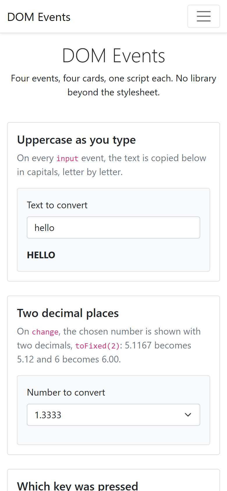

# dom-events

Four browser events, one card each, one script each. Type and watch the text
go uppercase, pick a number and see it rounded, press a key and read its name,
resize the window and watch a box change colour.

HTML, Bootstrap for the layout, and vanilla JavaScript. No build step, no
JavaScript library: open the file and try each card.

## Screenshots

## How it works

**One script per card, and nothing shared.** `js/uppercase.js`,
`js/decimals.js`, `js/key.js` and `js/width.js` each grab the elements they
need by id and attach one listener. Remove a card, remove one script tag and
one file; the other three do not notice.

**`input`, not `keyup`.** The uppercase card listens to `input`, which fires
on every change of the field's value, including a paste or a drag, where
`keyup` would only see keys.

**`toFixed(2)` does both the rounding and the padding.** 5.1167 becomes 5.12,
and 6 becomes 6.00 rather than 6, which a plain rounding would not give.

**`event.key` names every key.** A letter gives the letter, a special key
gives its name: ArrowLeft, Enter, Escape. The field is read-only and the
handler calls `preventDefault`, so nothing is ever typed into it; it only
serves as a place to put the focus.

**Width is read, never guessed.** The last card calls `window.innerWidth` on
`resize` and picks one of four Bootstrap background classes: `bg-danger`
under 600 px, `bg-success` under 900, `bg-primary` under 1200, `bg-secondary`
above. The same function runs once at load, so the box is right before the
first resize.

## Running it

Open `index.html` in a browser. There is nothing to install.

## Stack

HTML, Bootstrap 5.1 for the grid, the cards and the colours, and vanilla
JavaScript. Four scripts, no stylesheet of its own, no JavaScript library.

## Résumé

Quatre événements du navigateur, une carte et un script pour chacun. Un
champ recopié en majuscules à chaque `input`, qui réagit aussi au collage ;
une liste dont le nombre choisi s'affiche à deux décimales au `change`, par
`toFixed(2)`, qui arrondit et complète, 6 devenant 6.00 ; un champ en lecture
seule qui montre la touche enfoncée par `event.key` au `keydown`, y compris
les touches spéciales ; et un témoin dont la couleur suit `window.innerWidth`
au `resize`, rouge sous 600 px, vert sous 900, bleu sous 1200, gris au-delà,
calculée aussi au chargement. La mise en page et les couleurs viennent
entièrement de Bootstrap, sans feuille de style propre.

## Licence

MIT. See [LICENSE](LICENSE).
